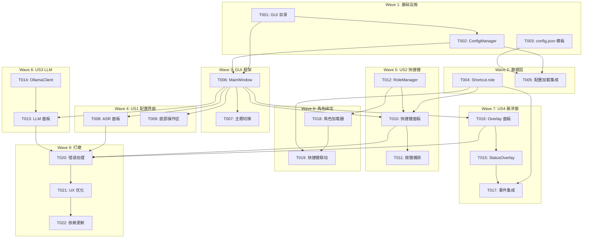

# Task List: CapsWriter-Offline GUI 配置工具

> **生成时间**: 2026-02-02T14:41:00+08:00  
> **来源文档**: spec.md, plan.md, design/*.md, data-model.md

---

## Wave Structure

### Wave 1: 基础设施 (可并行)
- [x] T001: 创建 GUI 模块目录结构 [P] ✅ `feat(T001): Create GUI module directory structure`
- [x] T002: 实现配置管理器 ConfigManager [P] ✅ `feat(T002): Implement ConfigManager for config.json handling`
- [x] T003: 创建默认 config.json 模板 [P] ✅ `feat(T003): Create config.json.example template`

### Wave 2: 数据层 (依赖 Wave 1)
- [ ] T004: 扩展 Shortcut 数据类（添加 role 字段）
- [ ] T005: 实现配置加载集成到启动流程

### Wave 3: GUI 框架 (依赖 Wave 1)
- [x] T006: 创建主窗口框架 MainWindow [P] ✅ `feat(T006): Create MainWindow framework with 4 LabelFrame sections`
- [x] T007: 实现主题切换系统 [P] ✅ `feat(T007): Theme switching system implemented in MainWindow`
- [x] **Bonus**: Windows 标题栏暗色模式 ✅ `feat: Windows title bar dark/light mode support via DWM API`

### Wave 4: GUI 面板 - US1 图形化配置 (依赖 Wave 3)
- [x] T008: 实现 ASR 模型配置面板 [P] ✅ `feat(T008): Implement ASRPanel with model selection and Vulkan options`
- [x] T009: 实现底部操作区（保存/启动按钮）✅ `feat(T009): Save configuration functionality implemented`

### Wave 5: GUI 面板 - US2 快捷键自定义 (依赖 Wave 3)
- [x] T010: 实现快捷键配置面板 ✅ `feat(T010): Implement ShortcutPanel with scene-based table`
- [x] T011: 实现按键捕获对话框 ✅ `feat(T011): Implement KeyCaptureDialog with pynput`
- [~] T012: 实现角色管理器 RoleManager ⏭️ 已跳过（不需要角色绑定功能）

### Wave 6: GUI 面板 - US3 LLM 配置 (依赖 Wave 3)
- [x] T013: 实现 LLM 配置面板 ✅ `feat(T013): Implement LLMPanel with table-based multi-config management`
- [x] T014: 实现 Ollama 客户端（获取模型列表）✅ `feat(T014): Ollama sync in LLMConfigDialog`

### Wave 7: 悬浮窗 - US4 实时状态反馈 (依赖 Wave 2)
- [x] T015: 实现状态悬浮窗 StatusOverlay ✅ `feat(T015): Implement StatusOverlay with timer and auto-hide`
- [x] T016: 实现悬浮窗配置面板 ✅ `feat(T016): Implement OverlayPanel with preview`
- [x] T017: 集成悬浮窗到客户端事件循环 ✅ `feat(T017): Integrate StatusOverlay with Tkinter-in-Thread pattern`

### Wave 8: LLM 角色绑定 (依赖 Wave 5)
- [ ] T018: 修改 LLM 角色加载器支持直接指定角色
- [ ] T019: 实现快捷键-角色联动逻辑

### Wave 9: 打磨与测试 (依赖 Wave 4-8)
- [ ] T020: 错误处理与验证 UI
- [ ] T021: 工具提示与用户体验优化
- [ ] T022: 更新 requirements-client.txt

---

## 任务详情

### T001: 创建 GUI 模块目录结构 [Wave 1] [Story Setup]
- **Files**: 
  - `gui/__init__.py`
  - `gui/panels/__init__.py`
- **Action**:
  - 创建 `gui/` 目录
  - 创建 `gui/panels/` 子目录
  - 创建空的 `__init__.py` 文件
- **Verify**: `python -c "import gui; import gui.panels"` → 无报错
- **Done**: 可以作为 Python 包导入

---

### T002: 实现配置管理器 ConfigManager [Wave 1] [Story US1]
- **Files**: `gui/config_manager.py`
- **Action**:
  - 实现 `ConfigManager` 类
  - 实现 `load()` 方法：读取 config.json，不存在则返回默认值
  - 实现 `save()` 方法：写入 config.json
  - 实现 `get_default()` 方法：返回完整默认配置
  - 实现 `validate()` 方法：验证配置合法性
  - 参考 `data-model.md` 中的 GUIConfig 结构
  - Do NOT: 直接修改 config.py
- **Verify**: `python -c "from gui.config_manager import ConfigManager; cm = ConfigManager(); print(cm.get_default())"` → 打印默认配置字典
- **Done**: load/save/validate 方法正常工作

---

### T003: 创建默认 config.json 模板 [Wave 1] [Story US1]
- **Files**: `config.json.example`
- **Action**:
  - 创建示例 config.json 文件
  - 包含所有字段的默认值（参考 data-model.md 3.1 节）
  - 包含注释说明各字段用途（JSON5 格式或单独 README）
- **Verify**: `python -c "import json; json.load(open('config.json.example'))"` → 无报错
- **Done**: 示例配置文件可被解析

---

### T004: 扩展 Shortcut 数据类 [Wave 2] [Story US2]
- **Files**: `util/client/shortcut/shortcut_config.py`
- **Action**:
  - 在 `Shortcut` 类中添加 `role: Optional[str] = None` 字段
  - 更新 `from_dict()` 方法解析 role 字段
  - 更新 `to_dict()` 方法导出 role 字段
  - Do NOT: 修改现有字段的默认值
- **Verify**: `python -c "from util.client.shortcut.shortcut_config import Shortcut; s = Shortcut.from_dict({'key': 'f1', 'role': '翻译'}); print(s.role)"` → `翻译`
- **Done**: Shortcut 可正确解析和导出 role 字段

---

### T005: 实现配置加载集成 [Wave 2] [Story US1]
- **Files**: `util/client/startup.py`
- **Action**:
  - 在客户端启动流程中检测 config.json 是否存在
  - 存在则加载并覆盖 ServerConfig/ClientConfig 对应字段
  - 不存在则继续使用 config.py 默认值
  - 添加日志输出配置来源
- **Verify**: 创建测试 config.json 后执行 `python start_client.py --dry-run`（如支持）或检查日志
- **Done**: 启动时正确加载 config.json 配置

---

### T006: 创建主窗口框架 MainWindow [Wave 3] [Story US1]
- **Files**: 
  - `edit_config_gui.py`
  - `gui/main_window.py`
- **Action**:
  - 创建 `edit_config_gui.py` 入口脚本，双击可启动
  - 创建 `MainWindow` 类继承 ttkbootstrap
  - 实现窗口初始化（标题、尺寸、图标）
  - 实现 4 个 LabelFrame 占位（ASR/快捷键/LLM/悬浮窗）
  - 实现底部按钮区占位
  - 参考 design-intent.md 1.1 节布局图
  - Do NOT: 在此任务中实现具体面板逻辑
- **Verify**: `python edit_config_gui.py` → 显示带有 4 个空分组框的窗口
- **Done**: 主窗口框架可正常显示

---

### T007: 实现主题切换系统 [Wave 3] [Story US1]
- **Files**: `gui/main_window.py`
- **Action**:
  - 从 config.json 读取 `theme` 字段
  - 初始化对应 ttkbootstrap 主题（light=litera, dark=darkly）
  - 在标题栏右侧添加主题切换按钮（☀️/🌙）
  - 实现点击切换主题功能
  - 切换后保存主题偏好到 config.json
  - 参考 style-guide.md 1.x 节和 design-intent.md 1.2 节
- **Verify**: `python edit_config_gui.py` → 点击主题按钮可切换浅色/深色主题
- **Done**: 主题切换功能正常，偏好持久化

---

### T008: 实现 ASR 模型配置面板 [Wave 4] [Story US1]
- **Files**: `gui/panels/asr_panel.py`
- **Action**:
  - 创建 `ASRPanel` 类
  - 实现 3 个模型单选按钮（Fun-ASR-Nano/SenseVoice/Paraformer）
  - 每个模型附带简短说明文字
  - 实现 Vulkan 加速复选框
  - 实现强制 FP32 复选框
  - FP32 仅在 Vulkan 启用时可勾选
  - 参考 design-intent.md 2.1 节
- **Verify**: `python edit_config_gui.py` → ASR 面板显示正确，单选/复选框可交互
- **Done**: ASR 配置面板功能完整

---

### T009: 实现底部操作区 [Wave 4] [Story US1] ✅
- **Files**: `gui/main_window.py`
- **Action**:
  - 实现「💾 保存配置」按钮
    - 收集所有面板配置
    - 调用 ConfigManager.save()
    - 显示成功/失败 Toast
  - 实现「🚀 启动服务」按钮
    - 自动保存配置
    - 启动 core_server.py（subprocess，隐藏控制台）
    - 延迟 2 秒后启动 core_client.py（subprocess）
    - 按钮变为「⏹ 停止服务」
  - 实现停止服务功能
    - 使用 taskkill 强制终止进程树
    - 恢复按钮状态
  - 实现窗口关闭确认（服务运行时）
  - 参考 design-intent.md 2.5 节
- **Verify**: 点击保存 → config.json 更新；点击启动 → 服务进程启动；点击停止 → 服务终止
- **Done**: ✅ 保存、启动、停止功能全部实现完成

---

### T010: 实现快捷键配置面板 [Wave 5] [Story US2]
- **Files**: `gui/panels/shortcut_panel.py`
- **Action**:
  - 创建 `ShortcutPanel` 类
  - 实现 Treeview 表格：按键/类型/模式/角色/启用
  - 实现「+ 添加快捷键」按钮
  - 实现「- 删除选中」按钮
  - 实现行内编辑（双击单元格）
  - 角色列使用下拉选择（从 RoleManager 获取）
  - 参考 design-intent.md 2.2 节
- **Verify**: 可添加/删除/编辑快捷键行
- **Done**: 快捷键表格完整可用

---

### T011: 实现按键捕获对话框 [Wave 5] [Story US2]
- **Files**: `gui/shortcut_capture.py`
- **Action**:
  - 创建 `ShortcutCaptureDialog` 类
  - 显示「请按下要绑定的快捷键...」提示
  - 使用 pynput 监听键盘/鼠标事件
  - 捕获后自动识别类型（keyboard/mouse）
  - 返回标准化按键名称
  - 参考 plan.md 附录 A3
- **Verify**: 弹出对话框 → 按键 → 返回正确按键名
- **Done**: 可捕获键盘按键和鼠标侧键

---

### T012: 实现角色管理器 RoleManager [Wave 5] [Story US2]
- **Files**: `gui/role_manager.py`
- **Action**:
  - 创建 `RoleManager` 类
  - 实现 `get_roles()` 方法：扫描 `LLM/` 目录
  - 过滤并返回所有 `.py` 文件名（不含后缀）
  - 添加「无」选项作为默认
  - 缓存结果，提供刷新方法
- **Verify**: `python -c "from gui.role_manager import RoleManager; print(RoleManager().get_roles())"` → 返回角色列表
- **Done**: 可正确获取 LLM 角色列表

---

### T013: 实现 LLM 配置面板 [Wave 6] [Story US3]
- **Files**: `gui/panels/llm_panel.py`
- **Action**:
  - 创建 `LLMPanel` 类
  - 实现本地/云端单选切换
  - 本地区域：Ollama 模型下拉框
  - 云端区域：Provider/API Key/Model 输入
  - API Key 使用 show='*' 掩码，可切换可见性
  - 中断键下拉选择
  - 切换来源时启用/禁用对应区域
  - 参考 design-intent.md 2.3 节
- **Verify**: 可切换本地/云端，输入框正确启用/禁用
- **Done**: LLM 配置面板功能完整

---

### T014: 实现 Ollama 客户端 [Wave 6] [Story US3]
- **Files**: `gui/ollama_client.py`
- **Action**:
  - 创建 `OllamaClient` 类
  - 实现 `get_models()` 方法：执行 `ollama list` 命令
  - 解析输出，提取模型名称列表
  - 处理 Ollama 未安装的情况（返回空列表）
  - 添加超时处理
- **Verify**: 已安装 Ollama 时返回模型列表，未安装时返回空列表无报错
- **Done**: 可正确获取本地 Ollama 模型

---

### T015: 实现状态悬浮窗 StatusOverlay [Wave 7] [Story US4] ✅
- **Files**: `gui/status_overlay.py`
- **Action**:
  - ✅ 创建 `StatusOverlay` 类 (tk.Toplevel)
  - ✅ 实现无边框透明窗口（overrideredirect, topmost, alpha）
  - ✅ 实现 show(status, role) 方法
  - ✅ 实现 hide(delay_ms) 方法
  - ✅ 实现状态图标（🎙️录音/⏳处理/✅完成/❌错误）
  - ✅ 实现录音时长实时更新（100ms 刷新）
  - ⏳ 淡入淡出动画（未实现，当前为即时显隐）
  - ✅ 位置预设系统（5 个位置）
  - ✅ 全局单例访问函数 get_overlay(), show_status(), hide_status()
- **Verify**: ✅ 调用 show('recording') → 显示悬浮窗；调用 hide(1500) → 1.5秒后隐藏
- **Done**: ✅ 悬浮窗显示/隐藏/计时正常

---

### T016: 实现悬浮窗配置面板 [Wave 7] [Story US4] ✅
- **Files**: `gui/panels/overlay_panel.py`
- **Action**:
  - ✅ 创建 `OverlayPanel` 类
  - ✅ 实现启用开关复选框 (round-toggle 样式)
  - ✅ 实现位置下拉选择（5 个预设位置：四角 + 中央）
  - ✅ 实现透明度滑块（30%-100%）带百分比标签
  - ✅ 实现自动隐藏延迟 Spinbox（0.5-10 秒）
  - ✅ 启用开关控制整个配置区域的 disabled 状态
  - ✅ 预览按钮：依次演示录音/处理/完成状态
- **Verify**: ✅ 可配置悬浮窗各项参数，预览功能正常
- **Done**: ✅ 悬浮窗配置面板功能完整，已集成到 MainWindow

---

### T017: 集成悬浮窗到客户端事件循环 [Wave 7] [Story US4]
- **Files**: 
  - `util/client/state.py`
  - `util/client/shortcut/shortcut_manager.py`
- **Action**:
  - 在 state.py 添加悬浮窗事件接口（on_recording_start, on_recording_stop 等）
  - 在 shortcut_manager.py 中：
    - 按键按下时发送 recording_start 事件
    - 按键松开时发送 recording_stop 事件
    - 识别完成时发送 recognition_done 事件
  - 传递角色信息（如快捷键绑定了角色）
- **Verify**: 长按快捷键 → 悬浮窗显示「正在录音」→ 松开 → 显示「正在识别」
- **Done**: 悬浮窗与识别流程联动

---

### T018: 修改 LLM 角色加载器 [Wave 8] [Story US2]
- **Files**: `util/llm/llm_role_loader.py`（或对应文件）
- **Action**:
  - 添加 `load_role_by_name(role_name: str)` 方法
  - 支持直接指定角色名加载（跳过语音前缀匹配）
  - 保持现有前缀匹配逻辑不变
- **Verify**: 可通过角色名直接加载对应角色配置
- **Done**: 支持两种角色加载方式

---

### T019: 实现快捷键-角色联动逻辑 [Wave 8] [Story US2]
- **Files**: `util/client/` 中识别完成后的处理逻辑
- **Action**:
  - 识别完成后检查触发快捷键是否绑定 role
  - 如有绑定：调用 load_role_by_name(role) 加载角色
  - 如无绑定：走原有语音前缀匹配流程
  - 在悬浮窗显示当前使用的角色名
- **Verify**: F1 绑定「翻译」→ 长按 F1 识别 → 自动使用翻译角色处理
- **Done**: 快捷键可直接触发绑定角色

---

### T020: 错误处理与验证 UI [Wave 9] [Story US1-US4]
- **Files**: 
  - `gui/dialogs.py`
  - `gui/validators.py`
- **Action**:
  - 创建验证错误对话框（参考 design-intent.md 5.1）
  - 创建运行时错误对话框（参考 design-intent.md 5.2）
  - 实现 Toast 提示组件
  - 在保存时调用 validate()，显示错误列表
- **Verify**: 配置错误时显示详细错误对话框
- **Done**: 错误处理 UI 完善

---

### T021: 工具提示与用户体验优化 [Wave 9] [Story US1-US4]
- **Files**: 各面板文件
- **Action**:
  - 为所有配置项添加 Tooltip 说明
  - 优化表格交互（选中高亮、快捷键）
  - 添加快捷键说明标签
  - 测试各边界情况（config.json 不存在、格式错误、Ollama 未安装）
- **Verify**: 鼠标悬停显示提示，交互流畅
- **Done**: 用户体验良好

---

### T022: 更新 requirements-client.txt [Wave 9] [Story Setup]
- **Files**: `requirements-client.txt`
- **Action**:
  - 添加 `ttkbootstrap>=1.10`
  - 确认其他依赖无需修改（pynput 已有）
- **Verify**: `pip install -r requirements-client.txt` → 安装成功
- **Done**: 依赖列表完整

---

## 依赖图谱



---

## 并行执行建议

### Wave 1 (可完全并行)
```
T001 | T002 | T003  (同时执行)
```

### Wave 3 (可完全并行，在 Wave 1 完成后)
```
T006 | T007  (同时执行)
```

### Wave 4-6 面板 (可部分并行，在 Wave 3 完成后)
```
T008 ← T009 (顺序)
T010 ← T011 (顺序)   |  T013 ← T014 (顺序)
        ↑                    ↑
      T012                 (并行)
```

---

## 实现策略

### MVP 范围 (建议)
1. **Phase 1 MVP**: T001-T009 (基础设施 + GUI 框架 + ASR 配置 + 保存)
   - 用户可通过 GUI 选择 ASR 模型并保存
   - 验收: P1 用户故事完成

2. **Phase 2**: T010-T014 (快捷键 + LLM 配置)
   - 用户可自定义快捷键和 LLM 设置
   - 验收: P2 + P3 用户故事完成

3. **Phase 3**: T015-T019 (悬浮窗 + 角色绑定)
   - 实时状态反馈和角色联动
   - 验收: P4 用户故事完成 + 角色绑定

4. **Phase 4**: T020-T022 (打磨)
   - 错误处理、UX 优化、依赖更新
   - 验收: 全部用户故事完成

---

## 任务摘要

| 指标 | 值 |
|------|-----|
| **总任务数** | 22 |
| **Wave 数** | 9 |
| **可并行任务** | 8 (标记 [P]) |
| **US1 (配置界面)** | T001-T003, T005-T009 |
| **US2 (快捷键)** | T004, T010-T012, T018-T019 |
| **US3 (LLM)** | T013-T014 |
| **US4 (悬浮窗)** | T015-T017 |
| **预计 MVP 时间** | Wave 1-4 (~9 任务) |

---

## 下一步

1. **推荐**: 运行 `/speckit.analyze` 检查文档一致性
2. 或直接运行 `/speckit.implement` 开始实现
