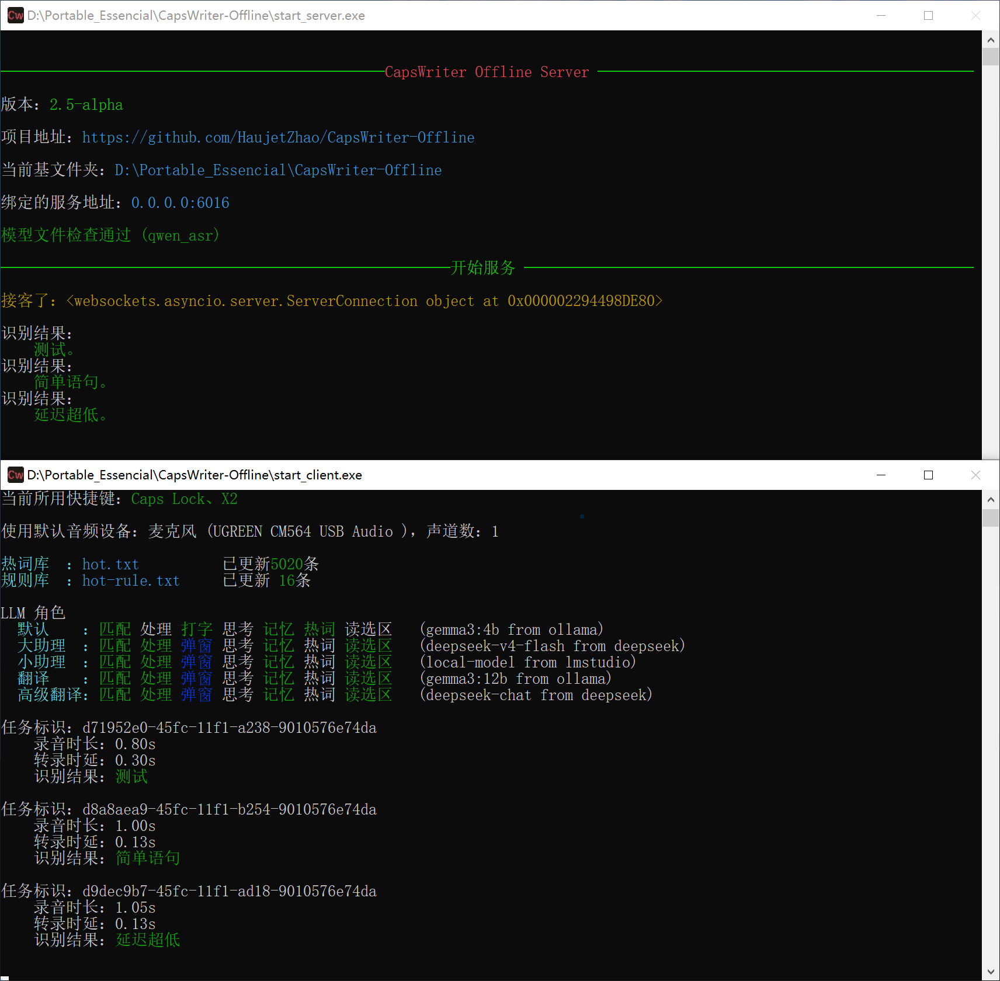

# 显卡加速的若干问题

CapsWriter-Offline 支持多种 ASR 引擎：

| 引擎名 | 准确性 | 速度 | 格式 | 调用方式 | 显卡加速 |
|------|-------|------|------|---------|---------|
| Paraformer | ★★★☆☆ | ★★★★★ | ONNX | sherpa_onnx | ❌ |
| SenseVoice-Small | ★★★☆☆ | ★★★★★ | ONNX | 自定义引擎 | ✅ |
| Fun-ASR-Nano | ★★★★☆ | ★★★★☆ | ONNX + GGUF | 自定义引擎 | ✅ |
| Qwen3-ASR | ★★★★★ | ★★★☆☆ | ONNX + GGUF | 自定义引擎 | ✅ |


Paraformer 通过 sherpa_onnx 调用，不支持显卡加速，且需要外挂标点符号模型，不建议使用，仅作纪念性保留。

性能差的电脑，建议用 SenseVoice-Small；没有独显的电脑可以尝试用 Fun-ASR-Nano 和 Qwen3-ASR，如果延迟可以接受就用；有独显的电脑直接上最顶级的 Qwen3-ASR，准确率夯爆。


---

## 一、加速概览

所有的模型原本都是 PyTorch 格式，这种格式在推理时速度较慢，为更好的推理，他们被转为了 ONNX 格式。

Fun-ASR-Nano 与 Qwen3-ASR 的 LLM Decoder 部分，作者发现用 LLama.cpp 能够实现更快的速度、更低的延迟、更少的显存占用，因此将这部分转为了 GGUF 格式，用  LLama.cpp 推理。

| 组件 | 后端 | 运行方式 |
|------|---------|------|
| ONNX 组件 | ONNX Runtime | CPU / DirectML  |
| GGUF 组件 | llama.cpp | CPU / Vulkan |

---

## 二、ONNX 组件加速

ONNX 组件可以通过设置 Provider 配置使用 CPU 或 DirectML 显卡加速。

RTX5050 开启 DML 加速时，对于30秒内的音频，SenseVoice-Small 的识别延迟不到 80ms。

有朋友实测他的 AMD 集显、AMD 独显在打开 DirectML 加速后，反而可能导致变慢，为了让这部份用户开箱可用，`DML` 加速默认是关的，需手动修改打开。

### Provider 如何配置

编辑 [config_server.py](../config_server.py)，找到你使用的引擎配置类，修改 `onnx_provider`：

```python
FunASRNanoGGUFArgs(
    onnx_provider='DML',        # ← 改为 DML，即可用 DirectML 显卡加速
    llm_use_gpu=True,           # GGUF 部分是否用 GPU，默认 True
    dml_pad_to=30,              # DML 专用优化参数
)

SenseVoiceArgs(
    onnx_provider='DML',        # ← 改为 DML，即可用 DirectML 显卡加速
    dml_pad_to=30,
)
```


### dml_pad_to 参数

DirectML 有一个特性：每次 ONNX 模型输入形状变化时，都会重新编译着色器，导致约200ms的固定延迟开销。

为此引入了 `dml_pad_to` 参数：将短音频统一填充到指定时长（秒），使 ONNX 输入形状固定。默认 `30` 秒，通常不需要修改，只会在 DML 开启时起作用。

### CUDA 加速

CUDA 可以实现比 DML 快 50% 的加速效果，但是打包 CUDA 支持需要几百兆大小，而且需要用户安装 CUDA 驱动和 cuDNN，打包起来不划算。从源码运行的朋友，如果配置了 CUDA 环境，可以 `pip install onnxruntime-gpu` 并将 Provider 改为 `CUDA`，即可启用 CUDA 加速。


---

## 三、GGUF 组件加速

对于使用 llama.cpp 解码器的引擎（**Fun-ASR-Nano**、**Qwen-ASR**、**ForceAligner**），GGUF 模型默认启用 GPU 加速：

```python
llm_use_gpu = True       # 将 GGUF 层全部卸载到 GPU
```

打包里的 LLama.cpp 的显卡加速由 Vulkan 后端实现。

部分 Intel 集成显卡在 GPU 解码 GGUF 时可能出现精度溢出（识别结果乱码），只能将 `llm_use_gpu` 改为 `False` 用 CPU 运行。

部分 Nvidia 独显用户，可能由于未知的系统问题，导致无法使用 Vulkan 加载模型，此时有两种解决路径：

- 将 `llm_use_gpu` 改为 `False` 用 CPU 运行
- 弃用 Vulkan，改用 CUDA 加速。确保安装 CUDA 驱动后，前往 llama.cpp [Releases](https://github.com/ggerganov/llama.cpp/releases) 页面，找到最新版本，下载 CUDA 发行包，将其 dll 替换到 `core/server/engines/llama` 文件夹里。

部分集显用户，可能会 Vulkan 载入模型失败，或者遇到「解码有误，强制熔断」的输出，在 `config_server.py` 中有这样的注释，可尝试将对应的补丁取消注释，让补丁生效：

```python
class ServerConfig:

    ...

    # 集成显卡兼容性补丁
    # os.environ["GGML_VK_DISABLE_COOPMAT"] = "1"   # AMD集显无法加载 GGUF 模型时尝试
    # os.environ["GGML_VK_DISABLE_F16"] = "1"       # 集成显卡解码有误，强制熔断时尝试
```

### GPU 预加速功能

几乎所有独显都采用类似的电源策略：有负载任务时显存频率提升到全速（如 9000MHz），空闲时降到很低（如 405MHz）以省电。当新任务到来时，频率再提升上去——但这个提升过程有延迟（约 100~200ms），导致 ASR 这种"短突发"型负载每次都被冷启动惩罚。实测 RTX5050 Qwen3-ASR 在显存降频后冷启动转录延迟升至约 **300ms**。

为了解决这个问题，我引入了 **GPU 预加速**功能，默认关闭，可在 `config_server.py` 中配置开启：

```python
# GPU 预加速配置（有识别任务时，提前调高显存频率，降低延迟，需管理员权限运行）
gpu_boost_enabled = False                   # 总开关，默认关闭
gpu_boost_cmd = 'nvidia-smi -lmc 9000'      # GPU 预加速命令，锁定显存频率
gpu_unboost_cmd = 'nvidia-smi -rmc'         # GPU 取消预加速命令，解锁显存频率
gpu_unboost_timeout = 1                     # 空闲多少秒后取消加速
```

该功能本质上是让服务端在适当时机执行两条 Shell 命令：

| 时机 | 命令 | 作用 |
|------|------|------|
| 录音开始 | `nvidia-smi -lmc 9000` | 锁定显存频率到 9000MHz |
| 空闲超时 | `nvidia-smi -rmc` | 恢复显存到默认频率 |

默认命令针对 **NVIDIA 显卡**。我还不确定AMD 显卡应该用什么命令。

这种方式不会对显卡有任何负作用，独显在有负载时也会被动升高显存频率。我们只是在录音开始时就主动升高显存频率，在录音结束后开始识别时，直接享受高带宽、低延迟。

开启 GPU 预加速时，**必须**以管理员权限运行服务端，否则 `nvidia-smi` 的锁频命令无法执行成功。

实测 RTX5050 锁定显存频率后，短音频转录延迟可从 300ms 降至 **100ms**。




---

## 四、常见问题

### Q: 怎么确认 GPU 加速生效了？

查看服务端日志 `logs/server_latest.log`，会显示 provider 信息：

```
[INFO] ONNX provider: DML
[INFO] GGUF GPU offload: True
```

同时识别速度会有明显提升（尤其是长音频），查看显存也会有占用的提升。

### Q: DirectML 比 CUDA 慢吗？

通常 CUDA 比 DML 快 10-30%。但 DML 的优势在于**通用性**——AMD 和 Intel 显卡也能用，且打包体积小。

### Q: 显存占用大吗？

SenseVoice 通常占用小于 1GB；Fun-ASR-Nano 与 Qwen-ASR 整体显存占用通常 1GB ~ 2GB。
