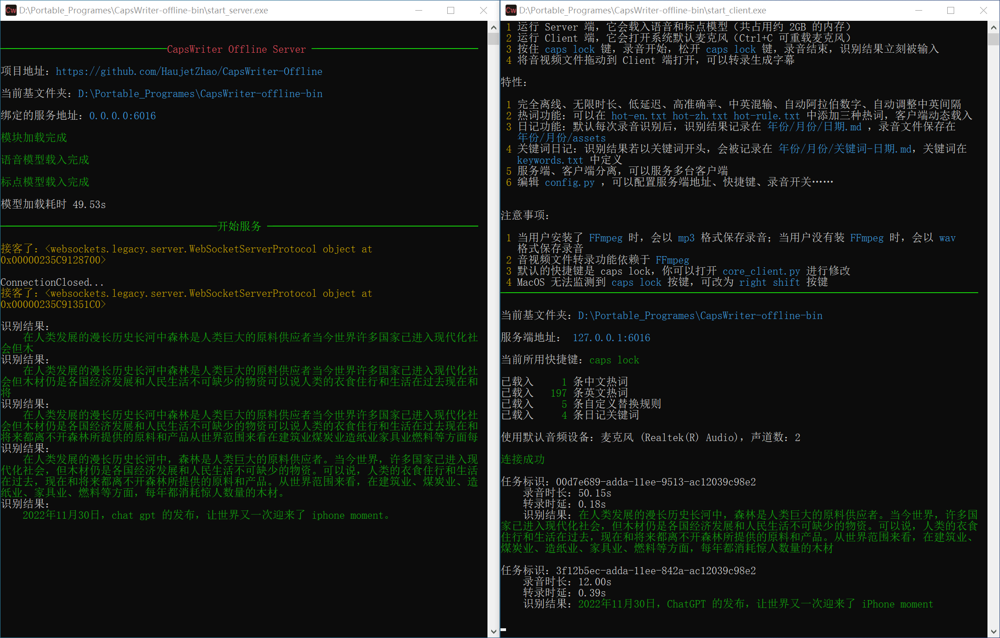

# CapsWriter-Offline (v2.0)



> **按住 CapsLock 说话，松开就上屏。就这么简单。**

CapsWriter-Offline 是一个运行在电脑上的**完全离线**语音输入工具。

核心功能就两个：
1.  **语音输入**：按住 `大写锁定键` (CapsLock) 说话，松开按键，文字立刻打进去。
2.  **文件转录**：把音视频文件拖进窗口，自动生成字幕文件。

完全离线，不联网，数据不出本机，隐私有保障。

---

## ✨ 主要特点

-   **完全离线**：所有模型都在本地跑，拔掉网线也能用。
-   **低延迟**：基于 WebSocket，说完松手，字就出来了。
-   **智能格式化**：自动加标点、中文数字转阿拉伯数字、调整中英文间距。
-   **热词替换**：支持自定义术语、人名、产品名，基于拼音模糊匹配，就算说得不标准也能认出来。
-   **日记归档**：可以自动把每天的语音记录保存成 Markdown 文件，方便日后查阅。
-   **LLM 润色（可选）**：可以接入本地或在线大模型，对识别结果进行润色、翻译等处理。

---

## 🚀 快速开始

### Windows 用户（懒人包）

1.  **下载**：从 [GitHub Releases](https://github.com/HaujetZhao/CapsWriter-Offline/releases) 下载打包好的压缩包和模型。
2.  **解压**：把软件和模型都解压出来，模型放到软件目录下的 `models` 文件夹里。
3.  **启动服务端**：双击 `start_server.exe`（会弹出一个黑窗口，别关它）。
4.  **启动客户端**：双击 `start_client.exe`（托盘会出现图标）。
5.  **开始用**：随便找个能打字的地方，按住 `CapsLock` 说话，松开就输入了。

> **系统要求**：Windows 10 64位及以上，需要安装 [VC++ 运行库](https://learn.microsoft.com/zh-cn/cpp/windows/latest-supported-vc-redist)。

### 源码运行（Linux / Mac / 开发者）

```bash
# 安装依赖
pip install -r requirements-server.txt
pip install -r requirements-client.txt

# Linux 还需要装 xclip
# sudo apt-get install xclip

# 启动
python core_server.py   # 服务端
python core_client.py   # 客户端（Linux/Mac 需要 sudo）
```

> **Mac 用户注意**：CapsLock 在 Mac 上监听有问题，建议在 `config.py` 里把快捷键改成 `right shift`。

---

## 🎤 功能详解

### 1. 语音输入

按住快捷键说话，松开就上屏。默认快捷键是 `CapsLock`，可以在 `config.py` 里改。

支持两种模式：
-   **对讲机模式**（默认）：按住说，松开停。
-   **录音笔模式**：按一下开始录，再按一下停止。

### 2. 热词替换

在 `hot.txt` 里写上你常用的专有名词（公司名、人名、产品名等），一行一个。
程序会基于拼音进行模糊匹配，就算语音识别结果不完全对，也能替换成正确的词。

另外还有：
-   `hot-rule.txt`：自定义替换规则，格式是 `原词 = 替换词`，比如 `毫安时 = mAh`。
-   `hot-rectify.txt`：LLM 纠错历史，会自动记录和学习。

### 3. 文件转录

把音频或视频文件直接拖到客户端窗口上，程序会自动转录并生成：
-   `.srt` 字幕文件
-   `.txt` 纯文本
-   `.json` 带时间戳的详细数据

### 4. 日记功能

开启 `save_audio` 后，每次语音输入都会保存录音和识别结果，按 `年/月/日.md` 的格式归档。
还可以在 `keywords.txt` 里定义关键词，比如"健康"、"工作"，说话时以关键词开头，就会归档到单独的文件里。

### 5. LLM 润色（可选功能）

如果你配置了 LLM（如本地 Ollama 或在线 API），可以对识别结果进行二次处理：
-   去除口语化的语气词
-   修正可能的错误
-   翻译、改写等

在 `LLM/` 文件夹下有角色配置文件，可以自定义不同的处理方式。
不需要这个功能的话，在 `config.py` 里把 `llm_enabled` 设为 `False` 就行。

---

## ⚙️ 配置说明

所有配置都在 `config.py` 里，常用的有：

| 配置项 | 说明 | 默认值 |
|--------|------|--------|
| `shortcut` | 触发录音的快捷键 | `caps lock` |
| `hold_mode` | 长按模式（True）还是点击模式（False） | `True` |
| `save_audio` | 是否保存录音文件 | `True` |
| `hot` | 是否启用热词替换 | `True` |
| `llm_enabled` | 是否启用 LLM 润色 | `True` |
| `model_type` | 语音识别模型 | `funasr_nano` |

### 关于模型

-   **funasr_nano**（默认推荐）：准确率最高，速度也不错。
-   **sensevoice**：支持多语言（中英日韩粤），综合体验好。
-   **paraformer**：老版本用的，现在一般用不到了。

---

## 🛠️ 常见问题

**Q: 按了没反应？**  
A: 检查服务端是不是在运行，客户端托盘图标还在不在。

**Q: Mac 上 CapsLock 不好使？**  
A: 在 `config.py` 里把 `shortcut` 改成 `right shift`。

**Q: 想隐藏黑窗口？**  
A: 可以用 VBS 脚本启动，或者创建快捷方式设置"最小化运行"。

**Q: 想开机自启？**  
A: 把快捷方式放到 `shell:startup` 文件夹里。

---

## 📦 下载地址

-   **GitHub Releases**：[https://github.com/HaujetZhao/CapsWriter-Offline/releases](https://github.com/HaujetZhao/CapsWriter-Offline/releases)
-   **百度网盘**：https://pan.baidu.com/s/1zNHstoWZDJVynCBz2yS9vg （提取码: eu4c）

> 百度盘链接可能会失效，GitHub 下载最可靠。

---

## ❤️ 致谢

本项目使用了以下开源项目：
-   [Sherpa-ONNX](https://github.com/k2-fsa/sherpa-onnx)
-   [FunASR](https://github.com/alibaba-damo-academy/FunASR)

如果觉得好用，欢迎打赏支持：

