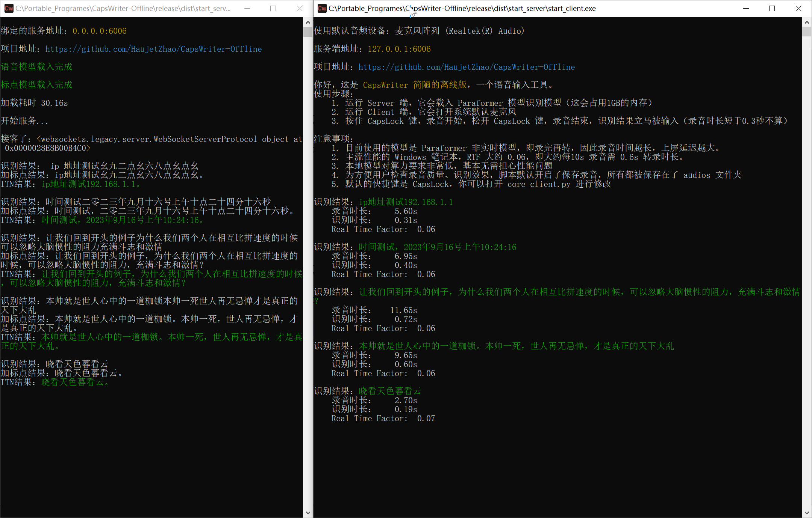
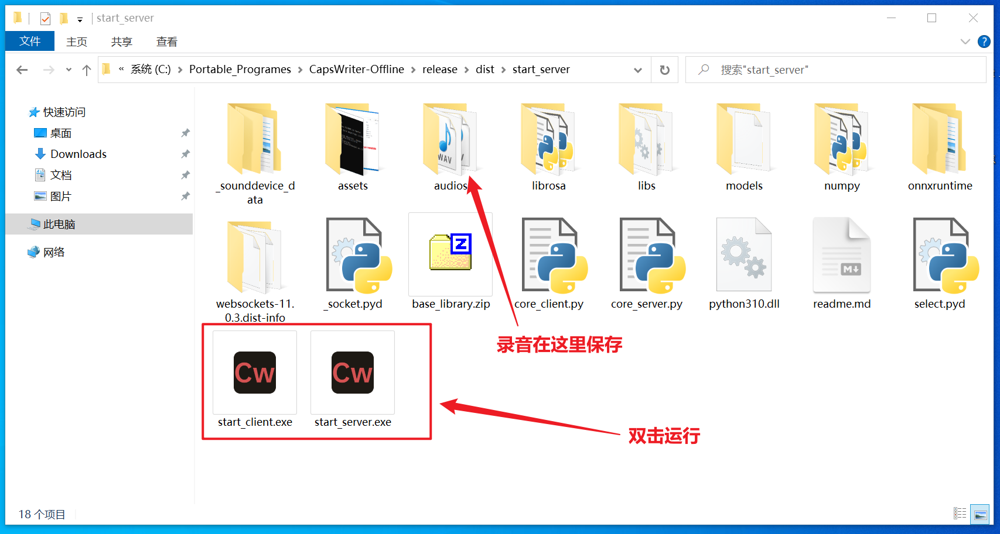
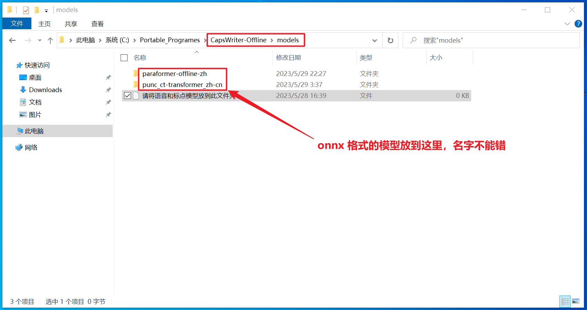

## CapsWriter 简陋的离线版

这是 `CapsWriter` 简陋的离线版，一个 PC 端的语音输入工具。

运行后，只要按下键盘上的 `大写锁定键`，就会开始录音，当你松开 `大写锁定键` 时，就会识别你的录音，并将识别结果立刻输入。

## 懒人包

已作 Win10-x86-64 打包版本，下载后双击 exe，分别打开 Server 和 Client 即可使用，下载地址：

- 百度盘: https://pan.baidu.com/s/1zNHstoWZDJVynCBz2yS9vg 提取码: eu4c 

其它系统，可以下载模型、安装依赖后从 Python 源码运行。

## 下载模型

本工具服务端使用了 [sherpa-onnx](https://k2-fsa.github.io/sherpa/onnx/index.html) ，载入阿里巴巴开源的 [Paraformer](https://www.modelscope.cn/models/damo/speech_paraformer-large_asr_nat-zh-cn-16k-common-vocab8404-pytorch/summary) 模型（[转为onnx格式](https://k2-fsa.github.io/sherpa/onnx/pretrained_models/offline-paraformer/paraformer-models.html)），来作语音识别，整个模型约 1GB 大小。你可以从这里下载到已转换好的模型文件：

- [csukuangfj/sherpa-onnx-paraformer-zh-2023-03-28 at main (huggingface.co)](https://huggingface.co/csukuangfj/sherpa-onnx-paraformer-zh-2023-03-28/tree/main) 

另外，还使用了阿里巴巴的标点符号模型（[转为了onnx格式](https://github.com/alibaba-damo-academy/FunASR/tree/main/funasr/export)）：

- [CT-Transformer标点-中文-通用-pytorch ](https://modelscope.cn/models/damo/punc_ct-transformer_zh-cn-common-vocab272727-pytorch/summary)

下载模型后，请将模型文件放入 `models` 文件夹内（如果下载的压缩包则需解压）

  

## 安装依赖

安装 Python 后，在 `cmd` 窗口进入本文件夹，运行 `pip install -r requirements.txt` 安装依赖

## 运行和使用

1. 运行 `core_server.py` 脚本，会载入 Paraformer 模型识别模型（这会占用1GB的内存，载入时长约十几秒）
2. 运行 `core_client.py` 脚本，它会打开系统默认麦克风，开始监听按键
3. 按住 `CapsLock` 键，录音开始，松开 `CapsLock` 键，录音结束，识别结果立马被输入（录音时长短于0.3秒不算）

## 注意事项

1. 目前使用的模型是 Paraformer 非实时模型，即录完再转，因此录音时间越长，上屏延迟越大。
2. 主流性能的 Windows 笔记本，RTF 大约 0.06，即大约每10s 录音需 0.6s 转录时长。
3. 本地模型对算力要求非常低，基本无需担心性能问题
4. 为方便用户检查录音质量、识别效果，脚本默认开启了保存录音，所有都被保存在了 `audios` 文件夹
5. 默认的快捷键是 `CapsLock`，你可以打开 `core_client.py` 进行修改

## 打赏

如果你愿意，可以以打赏的方式支持我一下：

