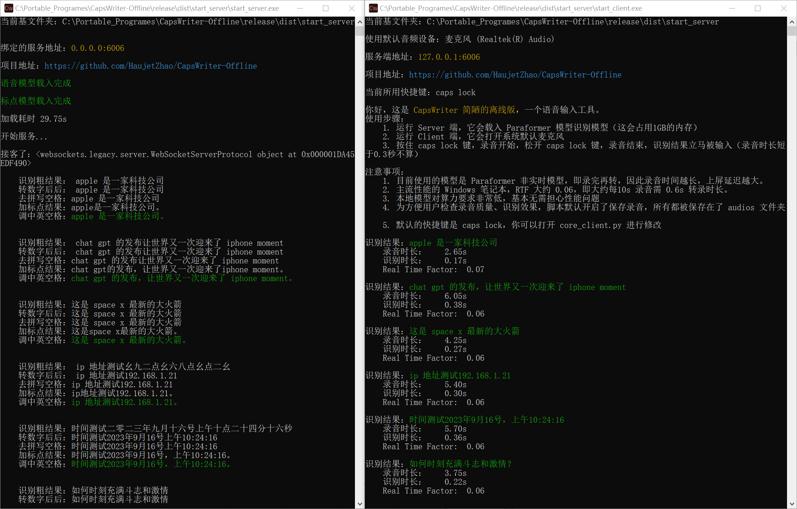
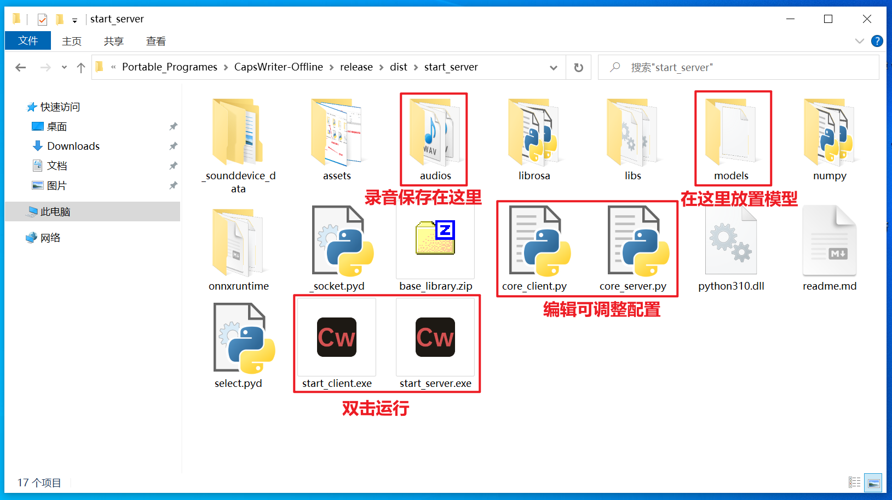
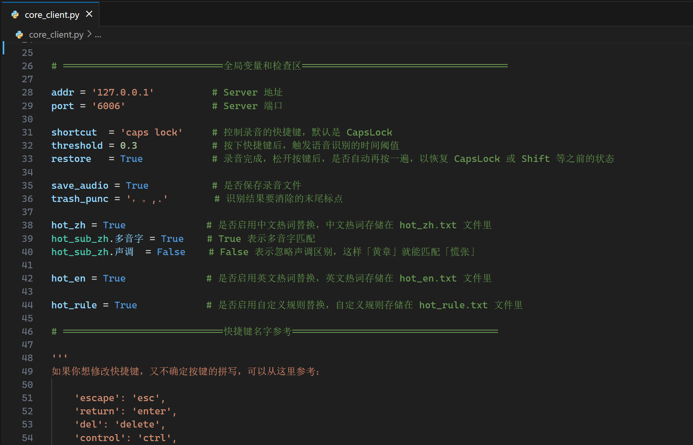

## CapsWriter 简陋的离线版

 

这是 `CapsWriter` 简陋的离线版，一个 PC 端的语音输入工具。

运行后，只要按下键盘上的 `大写锁定键`，就会开始录音，当你松开 `大写锁定键` 时，就会识别你的录音，并将识别结果立刻输入。

视频教程：[CapsWriter-Offline 电脑端离线语音输入工具](https://www.bilibili.com/video/BV1fo4y1T7KN/)  

## 懒人包

对于 Windows10 64 位用户，我打包了 `exe` 版本，可以从百度网盘或者 GitHub Releases界面下载。

由于模型文件太大，为了方便更新，打包版本中没有包含模型文件，所以需要分别手动下载软件和模型，模型文件也放在了百度网盘和 GitHub Releases 界面里边。

打包版本里有一个 `models` 文件夹，请把模型文件解压后放到 `models` 里，之后双击 `exe`，分别打开 `Server` 和 `Client` 即可使用。

下载地址：

- 百度盘: https://pan.baidu.com/s/1zNHstoWZDJVynCBz2yS9vg 提取码: eu4c 
- GitHub Release: [Releases · HaujetZhao/CapsWriter-Offline](https://github.com/HaujetZhao/CapsWriter-Offline/releases) 

打包后大小约 1.4G，下载要花些时间，主要是里面包含了模型文件。

（百度网盘容易掉链接，补链接太麻烦了，我不一定会补链接。GitHub Releases 界面下载是最可靠的。）

 

其它系统，可以下载模型、安装依赖后从 Python 源码运行。

## 修改配置

你可以打开 `core_server.py` ，在开头部分有注释，指导你修改服务端的端口，默认是 `6006`

你可以打开 `core_client.py` ，在开头部分有注释，指导你修改客户端的：

- 连接的地址和端口，默认是 `127.0.0.1` 和 `6006` 
- 键盘快捷键
- 是否要保存录音文件
- 要移除识别结果末尾的哪些标点，（如果你想把问号也删除掉，可以在这边加上）

## 热词替换

如果你有专用名词需要替换，可以加入热词文件。规则文件中以 `#` 开头的行以及空行会被忽略，可以用作注释。

- 中文热词请写到 `hot-zh.txt` 文件，每行一个，替换依据为拼音，实测每 1 万条热词约引入 3ms 延迟

- 英文热词请写到 `hot-en.txt` 文件，每行一个，替换依据为字母拼写

- 自定义规则热词请写到 `hot-rule.txt` 文件，每行一个，将搜索和替换词以等号隔开，如 `毫安时  =  mAh` 

你可以在 `core_client.py` 文件中配置是否匹配中文多音字，是否严格匹配拼音声调。

 

## 下载模型

本工具服务端使用了 [sherpa-onnx](https://k2-fsa.github.io/sherpa/onnx/index.html) ，载入阿里巴巴开源的 [Paraformer](https://www.modelscope.cn/models/damo/speech_paraformer-large_asr_nat-zh-cn-16k-common-vocab8404-pytorch/summary) 模型（[转为onnx格式](https://k2-fsa.github.io/sherpa/onnx/pretrained_models/offline-paraformer/paraformer-models.html)），来作语音识别，整个模型约 1GB 大小。下载有已转换好的模型文件：

- [csukuangfj/sherpa-onnx-paraformer-zh-2023-03-28 at main (huggingface.co)](https://huggingface.co/csukuangfj/sherpa-onnx-paraformer-zh-2023-03-28/tree/main) 

另外，还使用了阿里巴巴的标点符号模型（[转为了onnx格式](https://github.com/alibaba-damo-academy/FunASR/tree/main/funasr/export)）：

- [CT-Transformer标点-中文-通用-pytorch ](https://modelscope.cn/models/damo/punc_ct-transformer_zh-cn-common-vocab272727-pytorch/summary) 

**模型文件太大，并没有包含在 GitHub 库里面，你可以从百度网盘或者 GitHub Releases 界面下载已经转换好的模型文件，解压后，放入 `models` 文件夹。** 

- 模型打包下载：[models-Paraformer.Punctuation.zip](https://github.com/HaujetZhao/CapsWriter-Offline/releases/download/v0.3/models-Paraformer.Punctuation.zip)

## 安装依赖

安装 Python 后，在 `cmd` 窗口进入本文件夹，运行 `pip install -r requirements.txt` 安装依赖。

有些依赖在3.11还暂时不无法安装，建议使用 `python 3.10`

## 运行和使用

1. 运行 `core_server.py` 脚本，会载入 Paraformer 模型识别模型（这会占用1GB的内存，载入时长约十几秒）
2. 运行 `core_client.py` 脚本，它会打开系统默认麦克风，开始监听按键
3. 按住 `CapsLock` 键，录音开始，松开 `CapsLock` 键，录音结束，识别结果立马被输入（录音时长短于0.3秒不算）

## 注意事项

1. 目前使用的模型是 Paraformer 非实时模型，即录完再转，因此录音时间越长，上屏延迟越大。
2. 主流性能的 Windows 笔记本，RTF 大约 0.06，即大约每10s 录音需 0.6s 转录时长。
3. 本地模型对算力要求非常低，基本无需担心性能问题
4. 为方便用户检查录音质量、识别效果，脚本默认开启了保存录音，所有都被保存在了 `audios` 文件夹
5. 默认的快捷键是 `CapsLock`，你可以打开 `core_client.py` 进行修改

## 打赏

如果你愿意，可以以打赏的方式支持我一下：

