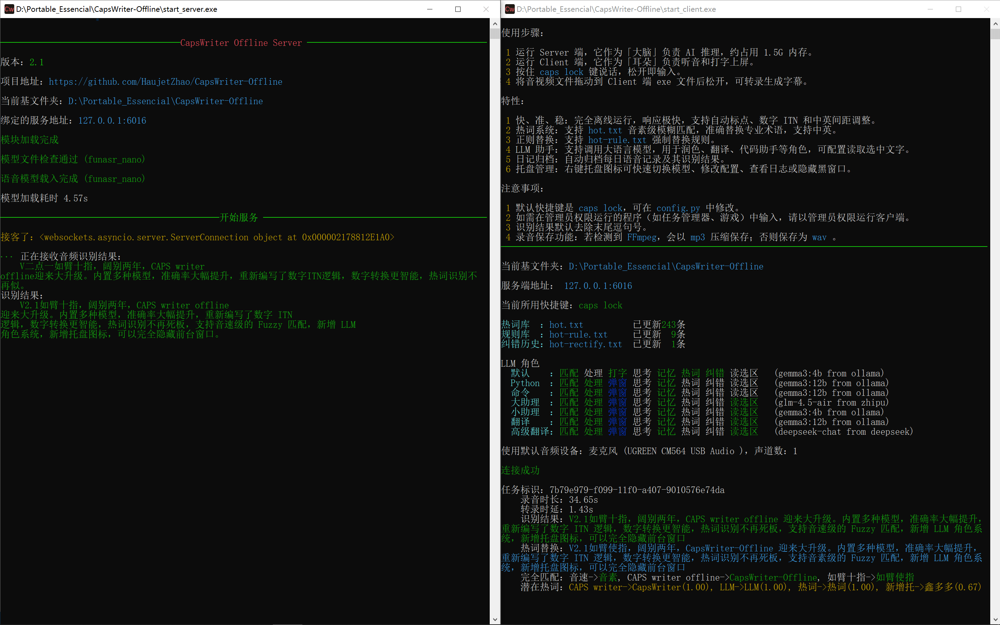

# CapsWriter-Offline (v2.4)

> **按住 CapsLock 说话，松开就上屏。就这么简单。**

**CapsWriter-Offline** 是一个专为 Windows 打造的**完全离线**语音输入工具。

## 🚀 更新说明：

v2.4新增：
- **改进 [Fun-ASR-Nano-GGUF](https://github.com/HaujetZhao/Fun-ASR-GGUF) 模型，使 Encoder 支持通过 DML 用显卡（独显、集显均可）加速推理，Encoder 和 CTC 默认改为 FP16 精度，以便更好利用显卡算力**，短音频延迟最低可降至 200ms 以内。
- 服务端 Fun-ASR-Nano 使用单独的热词文件 hot-server.txt ，只具备建议替换性，而客户端的热词具有强制替换性，二者不再混用
- Fun-ASR-Nano 加入采样温度，避免极端情况下的因贪婪采样导致的无限复读
- 服务端字母拼写合并处理

v2.3新增：
- **引入 [Fun-ASR-Nano-GGUF](https://github.com/HaujetZhao/Fun-ASR-GGUF) 模型支持，推理更轻快**
- 重构了大文件转录逻辑，采用异步流式处理
- 优化中英混排空格
- 增强了服务端对异常断连的清理逻辑

v2.2 新增：
-   **改进热词检索**：将每个热词的前两个音素作为索引进行匹配，而非只用首音素索引。
-   **UDP广播和控制**：支持将结果 UDP 广播，也可以通过 UDP 控制客户端，便于做扩展。
-   **Toast窗口编辑**：支持对角色输出的 Toast 窗口内容进行编辑。
-   **多快捷键**：支持设置多个听写键，以及鼠标快捷键，通过 pynput 实现。
-   **繁体转换**：支持输出繁体中文，通过 zhconv 实现。

v2.1 新增：
-   **更强的模型**：内置多种模型可选，速度与准确率大幅提升。
-   **更准的 ITN**：重新编写了数字 ITN 逻辑，日期、分数、大写转换更智能。
-   **RAG 检索增强**：热词识别不再死板，支持音素级的 fuzzy 匹配，就算发音稍有偏差也能认出。
-   **LLM 角色系统**：集成大模型，支持润色、翻译、写作等多种自定义角色。
-   **纠错检索**：可记录纠错历史，辅助LLM润色。
-   **托盘化运行**：新增托盘图标，可以完全隐藏前台窗口。
-   **完善的日志**：全链路日志记录，排查问题不再抓瞎。

这个项目鸽了整整两年，真不是因为我懒。在这段时间里，我一直在等一个足够惊艳的离线语音模型。Whisper 虽然名气大，但它实际的延迟和准确率始终没法让我完全满意。直到 `FunASR-Nano` 开源发布，它那惊人的识别表现让我瞬间心动，它的 `LLM Decoder` 能识别我讲话的意图进而调整输出，甚至通过我的语速决定在何时添加顿号，就是它了！必须快马加鞭，做出这个全新版本。

## ✨ 核心特性

-   **语音输入**：按住 `CapsLock` 键说话，松开即输入，默认去除末尾逗句号。支持对讲机模式和单击录音模式。
-   **文件转录**：音视频文件往客户端一丢，字幕 (`.srt`)、文本 (`.txt`)、时间戳 (`.json`) 统统都有。
-   **数字 ITN**：自动将「十五六个」转为「15~16个」，支持各种复杂数字格式。
-   **热词语境**：在 `hot-server.txt` 记下专业术语，经音素筛选后，用作 Fun-ASR-Nano 的语境增强识别 
-   **热词替换**：在 `hot.txt` 记下偏僻词，通过音素模糊匹配，相似度大于阈值则强制替换。
-   **正则替换**：在 `hot-rule.txt` 用正则或简单等号规则，精准强制替换。
-   **纠错记录**：在 `hot-rectify.txt` 记录对识别结果的纠错，可辅助LLM润色。
-   **LLM 角色**：预置了润色、翻译、代码助手等角色，当识别结果的开头匹配任一角色名字时，将交由该角色处理。
-   **托盘菜单**：右键托盘图标即可添加热词、复制结果、清除LLM记忆。
-   **C/S 架构**：服务端与客户端分离，虽然 Win7 老电脑跑不了服务端模型，但最少能用客户端输入。
-   **日记归档**：按日期保存你的每一句语音及其识别结果。
-   **录音保存**：所有语音均保存为本地音频文件，隐私安全，永不丢失。

**CapsWriter-Offline** 的精髓在于：**完全离线**（不受网络限制）、**响应极快**、**高准确率** 且 **高度自定义**。我追求的是一种「如臂使指」的流畅感，让它成为一个专属的一体化输入利器。无需安装，一个U盘就能带走，随插随用，保密电脑也能用。

LLM 角色既可以使用 Ollama 运行的本地模型，又可以用 API 访问在线模型。

## 💻 平台支持

目前**仅能保证在 Windows 10/11 (64位) 下完美运行**。

-   **Linux**：暂无环境进行测试和打包，无法保证兼容性。
-   **MacOS**：由于底层的 `keyboard` 库已放弃支持 MacOS，且系统权限限制极多，暂时无法支持。

## 🎬 快速开始

1.  **准备环境**：确保安装了 [VC++ 运行库](https://learn.microsoft.com/zh-cn/cpp/windows/latest-supported-vc-redist)。
2.  **下载解压**：下载 [Latest Release](https://github.com/HaujetZhao/CapsWriter-Offline/releases/latest) 里的软件本体，再到 [Models Release](https://github.com/HaujetZhao/CapsWriter-Offline/releases/tag/models) 下载模型压缩包，将模型解压，放入 `models` 文件夹中对应模型的文件夹里。
3.  **启动服务**：双击 `start_server.exe`，它会自动最小化到托盘菜单。
4.  **启动听写**：双击 `start_client.exe`，它会自动最小化到托盘菜单。
5.  **开始录音**：按住 `CapsLock` 就可以说话了！

## 🎤 模型说明

你可以在 `config_server.py` 的 `model_type` 中切换：

-   **funasr_nano**（默认推荐）：目前的旗舰模型，速度较快，准确率最高。
-   **sensevoice**：阿里新一代大模型，速度超快，准确率稍逊。
-   **paraformer**：v1 版本的主导模型，现主要作为兼容备份。

## ⚙️ 个性化配置

所有的设置都在根目录的 `config_server.py` 和 `config_client.py` 里：
-   修改 `shortcut` 可以更换快捷键（如 `right shift`）。
-   修改 `hold_mode = False` 可以切换为“点一下录音，再点一下停止”。
-   修改 `llm_enabled` 来开启或关闭 AI 助手功能。

## 🛠️ 常见问题

**Q: 为什么按了没反应？**  
A: 请确认 `start_server.exe` 的黑窗口还在运行。若想在管理员权限运行的程序中输入，也需以管理员权限运行客户端。

**Q: 为什么识别结果没字？**  
A: 到 `年/月/assets` 文件夹中检查录音文件，看是不是没有录到音；听听录音效果，是不是麦克风太差，建议使用桌面 USB 麦克风；检查麦克风权限。

**Q: Fun-ASR-Nano 模型几乎不能用？**  
A: Fun-ASR-Nano 的 LLM 解码器使用 llama.cpp 默认通过 Vulkan 实现显卡加速，部分集显在 FP16 矩阵计算时没有用 FP32 对加和缓存，可能导致数值溢出，影响识别效果，如果遇到了，可以到 config_server.py 中关闭 Vulkan，用 CPU 进行解码。

**Q: 需要热词替换？**  
A: 可在 `hot.txt` 中添加正确词汇（托盘菜单右键有快捷添加），或者在 `hot-rule.txt` 中用正则表达式强制替换。

**Q: 如何使用 LLM 角色？**  
A: 只需要在语音的**开头**说出角色名。例如，你配置了一个名为「翻译」的角色，录音时说「翻译，今天天气好」，翻译角色就会接手识别结果，在翻译后输出。它就像是一个随时待命的插件，你喊它名字，它就干活。你可以配置它们直接打字输出，或者在 TOAST 弹窗中显示。`ESC` 可以中断 LLM 的流式输出。

**Q: LLM 角色可以读取屏幕内容？**  
A: 是的。如果你的 AI 角色开启了 `enable_read_selection`，你可以先用鼠标选中屏幕上的一段文字，然后按住快捷键说：“翻译一下”，LLM 就会识别你的指令，将选中文字进行翻译。但当所选文字与上一次的角色输出完全相同时，则不会提供给角色，以避免浪费 token。

**Q: LLM 角色模型怎么选？**  
A: 你可以在 `LLM` 文件夹里为每个角色配置后端。既可以用 Ollama 部署本地轻量模型（如 gemma3:4b, qwen3:4b 等），也可以填写 DeepSeek 等在线大模型的 API Key。

**Q: 想要隐藏黑窗口？**  
A: 点击托盘菜单即可隐藏黑窗口。

**Q: 如何开机启动？**  
A: `Win+R` 输入 `shell:startup` 打开启动文件夹，将服务端、客户端的快捷方式放进去即可。

**Q: 我可以用 GPU 加速吗？**  
A: 加入 GPU 支持会增加打包大小，且边际效益很低，没有做。但从源码运行可以，把源码中的模型的 provider 改为 cuda 即可。

**Q: 低性能电脑转录太慢？**  
A: 更改 `config_server.py` 中的 `model_type` 模型类型，或更改 `num_threads`。

## 🚀 我的其他优质项目推荐

| 项目名称 | 说明 | 体验地址 |
| :--- | :--- | :--- |
| [**IME_Indicator**](https://github.com/HaujetZhao/IME_Indicator) | Windows 输入法中英状态指示器 | [下载即用](https://github.com/HaujetZhao/IME_Indicator/releases/latest/download/IME-Indicator.exe) |
| [**Rust-Tray**](https://github.com/HaujetZhao/Rust-Tray) | 将控制台最小化到托盘图标的工具 | [下载即用](https://github.com/HaujetZhao/Rust-Tray/releases/latest/download/Tray.exe) |
| [**Gallery-Viewer**](https://github.com/HaujetZhao/Gallery-Viewer-HTML) | 网页端图库查看器，纯 HTML 实现 | [点击即用](https://haujetzhao.github.io/Gallery-Viewer-HTML/) |
| [**全景图片查看器**](https://github.com/HaujetZhao/Panorama-Viewer-HTML) | 单个网页实现全景照片、视频查看 | [点击即用](https://haujetzhao.github.io/Panorama-Viewer-HTML/) |
| [**图标生成器**](https://github.com/HaujetZhao/Font-Awesome-Icon-Generator-HTML) | 使用 Font-Awesome 生成网站 Icon | [点击即用](https://haujetzhao.github.io/Font-Awesome-Icon-Generator-HTML/) |
| [**五笔编码反查**](https://github.com/HaujetZhao/wubi86-revert-query) | 86 五笔编码在线反查 | [点击即用](https://haujetzhao.github.io/wubi86-revert-query/) |
| [**快捷键映射图**](https://github.com/HaujetZhao/ShortcutMapper_Chinese) | 可视化、交互式的快捷键映射图 (中文版) | [点击即用](https://haujetzhao.github.io/ShortcutMapper_Chinese/) |

## ❤️ 致谢

本项目基于以下优秀的开源项目：

-   [Sherpa-ONNX](https://github.com/k2-fsa/sherpa-onnx)
-   [FunASR](https://github.com/alibaba-damo-academy/FunASR)

感谢 Google Antigravity、Anthropic Claude、GLM，如果不是这些编程助手，许多功能（例如基于音素的热词检索算法）我是无力实现的。

特别感谢那些慷慨解囊的捐助者，你们的捐助让我用在了购买这些优质的 AI 编程助手服务，并最终将这些成果反馈到了软件的更新里。

如果觉得好用，欢迎点个 Star 或者打赏支持：

	
