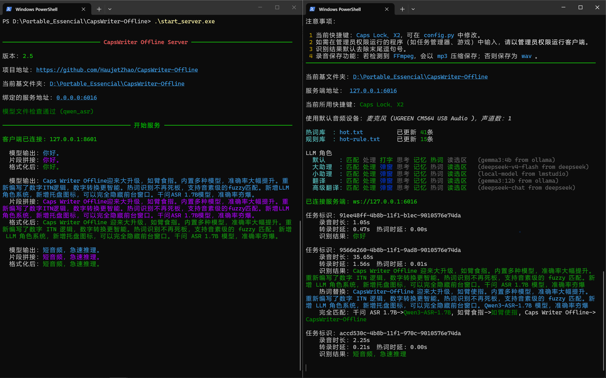

# CapsWriter-Offline

> **按住 CapsLock 说话，松开就上屏。就这么简单。**

**CapsWriter-Offline** 是一个专为 Windows 打造的**完全离线**语音输入工具。

## ✨ 核心特性

-   **语音输入**：按住 `CapsLock键` 或 `鼠标侧键X2` 说话，松开即输入，超低延迟，默认去除末尾逗句号。支持对讲机模式和单击录音模式。
-   **文件转录**：音视频文件往客户端 exe 一丢，字幕 (`.srt`)、文本 (`.txt`)、时间戳 (`.json`) 统统都有。
-   **数字 ITN**：自动将「十五六个」转为「15~16个」，支持各种复杂数字格式。
-   **热词替换**：在 `hot.txt` 记下偏僻词，通过音素模糊匹配，相似度大于阈值则强制替换。
-   **正则替换**：在 `hot-rule.txt` 用正则或简单等号规则，精准强制替换。
-   **LLM 角色**：预置了润色、小助理等角色，当识别结果的开头匹配任一角色名字时，将交由该角色处理。
-   **托盘菜单**：右键托盘图标即可添加热词、复制结果、清除LLM记忆。
-   **C/S 架构**：服务端与客户端分离，虽然 Win7 老电脑跑不了服务端模型，但最少能用客户端输入。
-   **日记归档**：按日期保存你的每一句语音及其识别结果。
-   **录音保存**：所有语音均保存为本地音频文件，隐私安全，永不丢失。

**CapsWriter-Offline** 的精髓在于：**完全离线**（不受网络限制）、**响应极快**、**高准确率** 且 **高度自定义**。我追求的是一种「如臂使指」的流畅感，让它成为一个专属的一体化输入利器。无需安装，一个U盘就能带走，随插随用，保密电脑也能用。

以下为支持的模型：

| 引擎名 | 准确性 | 速度 | 格式 | 显卡加速 |
|------|-------|------|------|---------|
| Paraformer | ★★★☆☆ | ★★★★★ | ONNX | ❌ |
| SenseVoice-Small | ★★★☆☆ | ★★★★★ | ONNX | ✅ |
| Fun-ASR-Nano | ★★★★☆ | ★★★★☆ | ONNX + GGUF | ✅ |
| Qwen3-ASR | ★★★★★ | ★★★☆☆ | ONNX + GGUF | ✅ |

性能参考（20s 音频转录延迟）：

| 模型 | CPU U9-285H | GPU RTX5050 |
|------|------------|------------|
| Paraformer | 0.6s | - |
| SenseVoice-Small | 0.6s | 0.15s |
| Fun-ASR-Nano | 2.0s | 0.5s |
| Qwen3-ASR-1.7B | 4.0s | 1.0s |

详细功能说明请参考 [`docs/`](docs/) 目录：
- [环境依赖安装说明](docs/环境依赖安装说明.md) — VC++ 运行库、FFmpeg 安装
- [热词功能如何使用](docs/热词功能如何使用.md) — 热词替换、规则替换、自定义短语
- [角色功能如何使用](docs/角色功能如何使用.md) — LLM 角色配置、输出模式、创建新角色
- [识别语言如何配置](docs/识别语言如何配置.md) — 各引擎语言支持范围与配置方法
- [文件转录功能如何使用](docs/文件转录功能如何使用.md) — 拖拽转字幕、时间戳对齐
- [显卡加速的若干问题](docs/显卡加速的若干问题.md) — DirectML、Vulkan 加速配置
- [模型下载的若干问题](docs/模型下载的若干问题.md) — 引擎选择、模型下载、目录结构
- [常见问题](docs/常见问题.md) — FAQ
- [更新日志](docs/CHANGELOG.md) 

## 💻 平台支持

目前**仅能保证在 Windows 10/11 (64位) 下完美运行**。

- **Linux**：暂无环境进行测试和打包，无法保证兼容性。
- **MacOS**：由于底层的 `keyboard` 库已放弃支持 MacOS，且系统限制极多，暂时无法支持。

[LazyTyper](https://lazytyper.com/) 和 [闪电说](https://shandianshuo.cn/) 也是很优秀的作品，都有离线引擎，都支持 Windows Linux 与 MacOS，并都有漂亮的图形化页面，推荐使用。

CapsWriter 的特别之处在于追求：

- 无感输入
- 完全离线，不受网络约束
- 低延迟，尽量做到硬件极限的最快速度
- 高度自定义的热词系统

## 🎬 快速开始

1.  **准备环境**：确保安装了 [VC++ 运行库](https://learn.microsoft.com/zh-cn/cpp/windows/latest-supported-vc-redist)。若要使用文件转录功能，还需安装 [ffmpeg](https://ffmpeg.org/download.html) 并确保其在系统 PATH 中。
2.  **下载解压**：下载 [Latest Release](https://github.com/HaujetZhao/CapsWriter-Offline/releases/latest) 里的软件本体，再到 [Models Release](https://github.com/HaujetZhao/CapsWriter-Offline/releases/tag/models) 下载模型压缩包，将模型解压，放入 `models` 文件夹中对应模型的文件夹里。
3.  **启动服务**：双击 `start_server.exe`，**它会自动最小化到托盘菜单**。
4.  **启动听写**：双击 `start_client.exe`，**它会自动最小化到托盘菜单**。
5.  **开始录音**：按住 `CapsLock键` 或 `鼠标侧键X2` 就可以说话了！

## ⚙️ 个性化配置

所有的设置都在根目录的 `config_server.py` 和 `config_client.py` 里，可直接编辑。

## 🛠️ 常见问题

**Q: 为什么按了没反应？**  
A: 请确认 `start_client.exe` 的黑窗口还在运行。若想在管理员权限运行的程序中输入，也需以管理员权限运行客户端。

**Q: 为什么识别结果没字？**  
A: 到 `年/月/assets` 文件夹中检查录音文件，看是不是没有录到音；听听录音效果，是不是麦克风太差，建议使用桌面 USB 麦克风；检查麦克风权限。

**Q: 想要隐藏黑窗口？**  
A: 点击托盘菜单即可隐藏黑窗口。

**Q: 如何开机启动？**  
A: `Win+R` 输入 `shell:startup` 打开启动文件夹，将服务端、客户端的快捷方式放进去即可。

更多问题请参阅 [docs/常见问题.md](docs/常见问题.md)。

## 🚀 我的其他优质项目推荐

| 项目名称 | 说明 | 体验地址 |
| :--- | :--- | :--- |
| [**IME_Indicator**](https://github.com/HaujetZhao/IME_Indicator) | Windows 输入法中英状态指示器 | [下载即用](https://github.com/HaujetZhao/IME_Indicator/releases/latest/download/IME-Indicator.exe) |
| [**Rust-Tray**](https://github.com/HaujetZhao/Rust-Tray) | 将控制台最小化到托盘图标的工具 | [下载即用](https://github.com/HaujetZhao/Rust-Tray/releases/latest/download/Tray.exe) |
| [**Gallery-Viewer**](https://github.com/HaujetZhao/Gallery-Viewer-HTML) | 网页端图库查看器，纯 HTML 实现 | [点击即用](https://haujetzhao.github.io/Gallery-Viewer-HTML/) |
| [**全景图片查看器**](https://github.com/HaujetZhao/Panorama-Viewer-HTML) | 单个网页实现全景照片、视频查看 | [点击即用](https://haujetzhao.github.io/Panorama-Viewer-HTML/) |
| [**图标生成器**](https://github.com/HaujetZhao/Font-Awesome-Icon-Generator-HTML) | 使用 Font-Awesome 生成网站 Icon | [点击即用](https://haujetzhao.github.io/Font-Awesome-Icon-Generator-HTML/) |
| [**五笔编码反查**](https://github.com/HaujetZhao/wubi86-revert-query) | 86 五笔编码在线反查 | [点击即用](https://haujetzhao.github.io/wubi86-revert-query/) |
| [**快捷键映射图**](https://github.com/HaujetZhao/ShortcutMapper_Chinese) | 可视化、交互式的快捷键映射图 (中文版) | [点击即用](https://haujetzhao.github.io/ShortcutMapper_Chinese/) |

## ❤️ 致谢

本项目基于以下优秀的开源项目：

-   [Sherpa-ONNX](https://github.com/k2-fsa/sherpa-onnx)
-   [FunASR](https://github.com/alibaba-damo-academy/FunASR)

感谢 Google Antigravity、Anthropic Claude、GLM、DeepSeek，如果不是这些编程助手，许多功能（例如基于音素的热词检索算法）我是无力实现的。

特别感谢那些慷慨解囊的捐助者，你们的捐助让我用在了购买这些优质的 AI 编程助手服务，并最终将这些成果反馈到了软件的更新里。

如果觉得好用，欢迎点个 Star 或者打赏支持：

	
